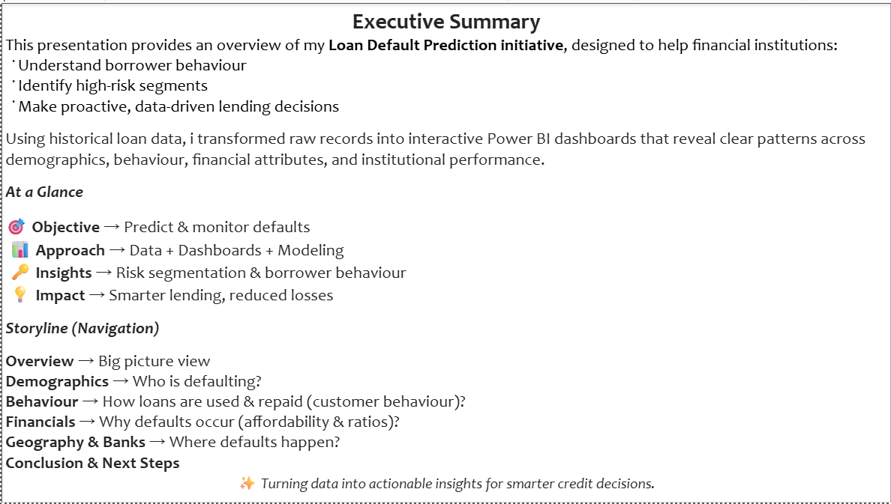
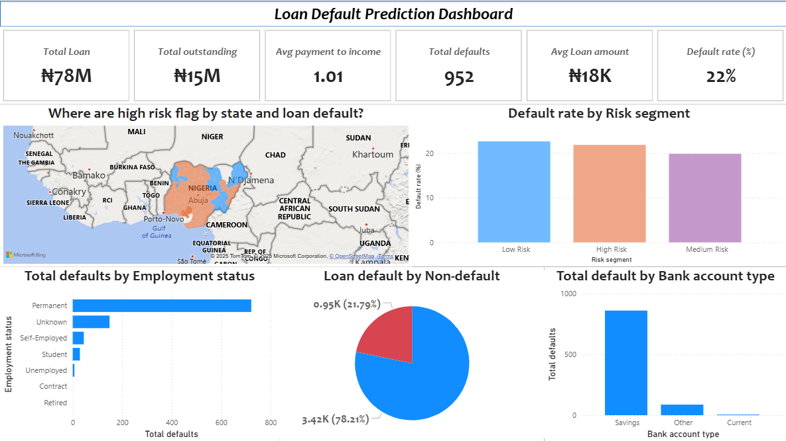
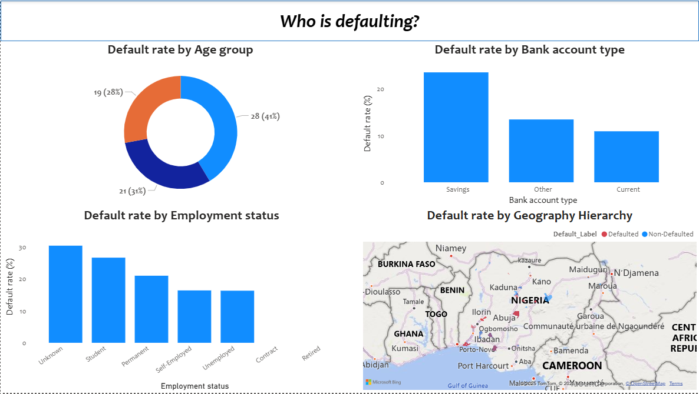
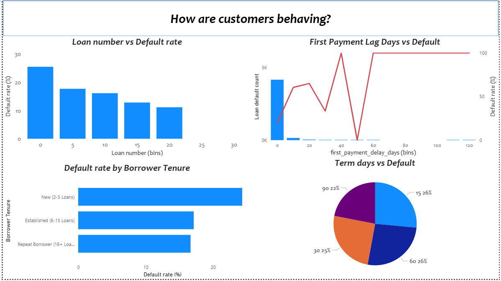
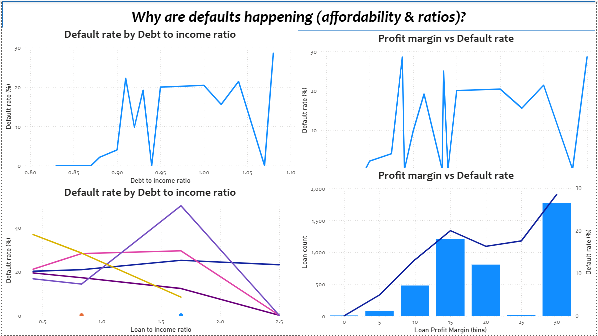
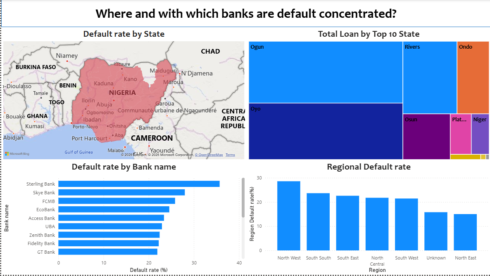
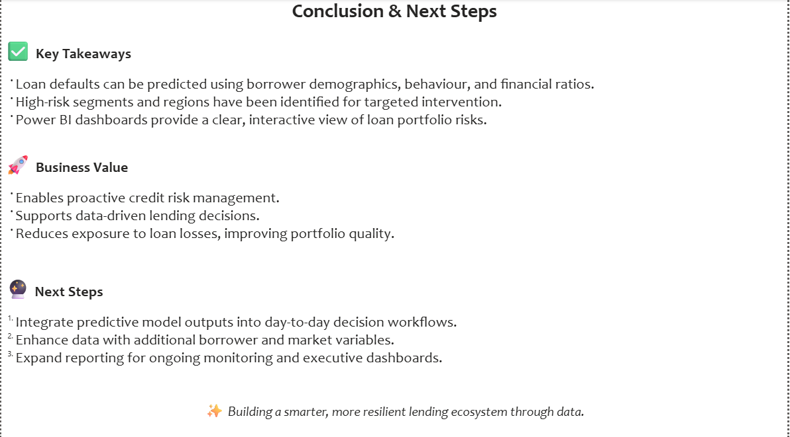

# 📊 Power BI Portfolio: Loan Default Prediction

## Introduction
This initiative empowers financial institutions with actionable insights into borrower behaviour and risk.  
Using historical loan data, interactive Power BI dashboards were created to reveal patterns across demographics, customer behaviour, financial health, and institutional performance.

**Objectives**
- Understand borrower behaviour and identify likely defaulters  
- Identify high-risk segments for proactive interventions  
- Enable data-driven lending decisions to reduce financial losses  

---

## 📑 Executive Summary

A high-level snapshot of loan portfolio risk:  
- Default vs Non-default breakdown  
- Key KPIs on repayment behaviour and portfolio exposure  
- Highlights of borrower demographics and risk segmentation  

---

## 🖥️ Overview

Key highlights from the overview dashboard include:  
- Loan default vs non-default distribution  
- Default rates across borrower categories  
- Snapshot of overall portfolio health  

---

## 👤 Demographics Insights

This section explores borrower characteristics:  
- Age distribution and default patterns  
- Employment type and default risk  
- Bank account type vs likelihood of default  

---

## 📈 Behavioural Insights

Focus on customer repayment and behavioural trends:  
- Monthly payment patterns (average, median, outliers)  
- Repayment delays and first-payment lags  
- Risk segmentation based on behavioural factors  

---

## 💰 Financial & Loan Insights

Analysis of financial attributes and loan health:  
- Credit score distribution and default correlation  
- Debt-to-income and loan-to-income ratios  
- Loan amount, tenure, and repayment performance  

---

## 🌍 Geographical & Institutional Insights

This section visualises loan defaults by region and bank:  
- State-level loan performance across Nigeria  
- Institutions with high vs low default exposure  
- Heatmaps for quick geographic risk assessment  

---

## ✅ Conclusion

Key takeaways from the Loan Default Prediction dashboard:  
- Loan defaults can be predicted using borrower demographics, behaviour, and financial ratios.  
- High-risk segments and regions have been identified for targeted intervention.  
- Power BI dashboards provide a clear, interactive view of loan portfolio risks.  

**Business Value**  
- Enables proactive credit risk management.  
- Supports data-driven lending decisions.  
- Reduces exposure to loan losses, improving portfolio quality.  

**Next Steps**  
1. Integrate predictive model outputs into day-to-day decision workflows.  
2. Enhance data with additional borrower and market variables.  
3. Expand reporting for ongoing monitoring and executive dashboards.  
